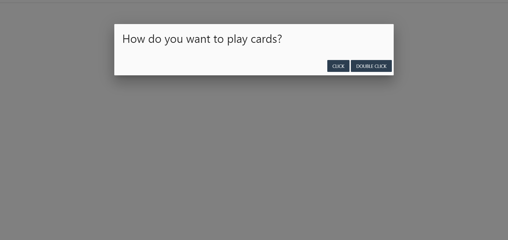
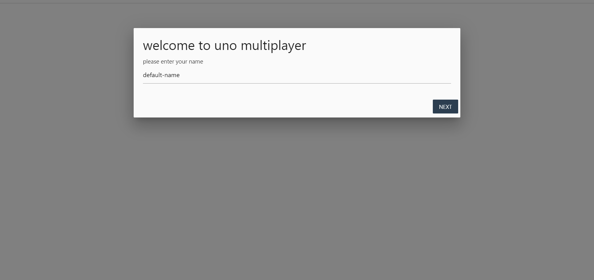
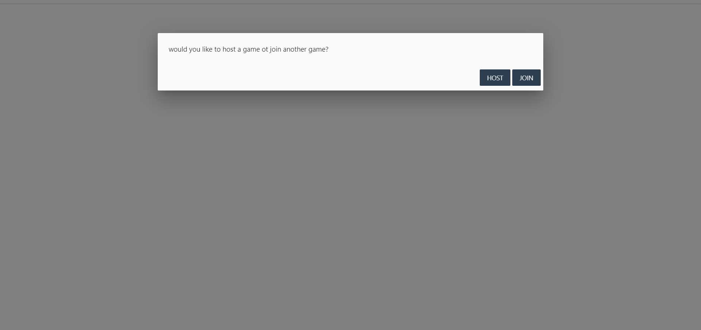
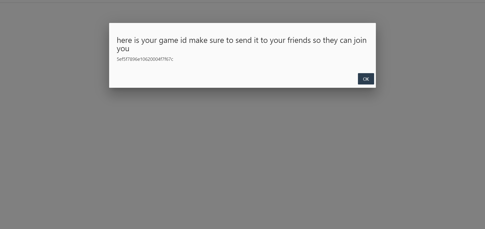
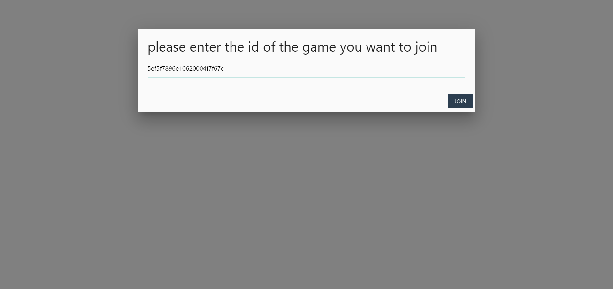
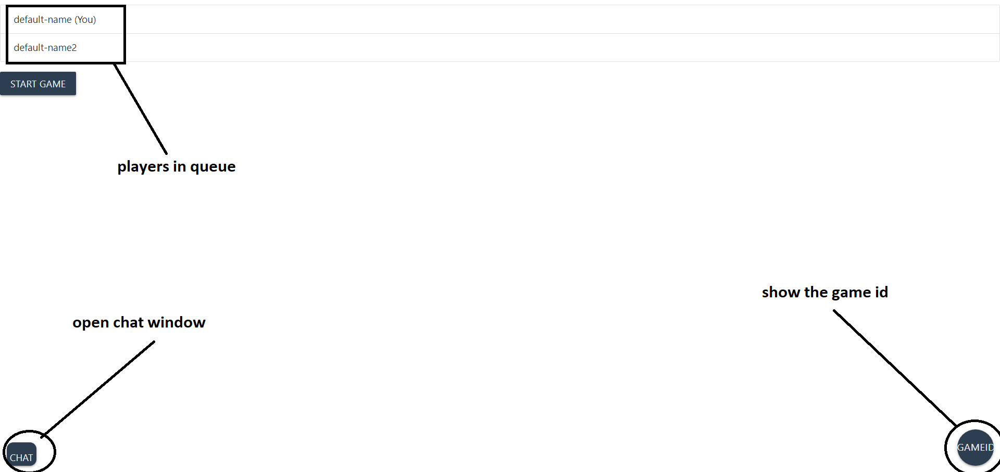

# :black_joker: uno multiplayer web app
### this is an uno multiplayer web application that can support theoretically infinite number of players at the same game so that you can enjoy the beauty of uno with your friends without leaving anyone behind

#### the game link: https://uno-multiplayer-nodejs.herokuapp.com/
 #### the game supports:
 <ul>
 <li>hosting and joining games</li>
 <li>unlimited number of players in the same game</li>
 <li>in game chat</li>
 <li>all the cards are supported with their special effects on the game</li>
 <li>score system</li>
 <li>the winner can have rematch with the same players after the game ends</li>
 <li>standard uno rules so no stacking or other non-standard rules are allowed</li>
 <li>the host can kick players</li>
 </ul>

### :eyeglasses: for tech nerds like me 
#### the technologies that the game runs on :
##### front end:
<ul>
<li>Pure html and css</li>
<li>Some parts of the game use ReactJS</li>
<li>Pure vanilla javascript for the server rendering</li>
</ul>

##### backend
<ul>
<li>Nodejs/express as a web server</li>
<li>Socket.io to handle web sockets</li>
<li>Mongodb/mongoose as database</li>
<li>Typescript to add strong types to vanilla javascript</li>
</ul>

#### almost all the game is written in typescript/javascript for both the backend and front end 

### walkthrough the game
<h4>choose how you want to play cards whether by single or double mouse click</h4>

<h4>enter the nickname you want to use</h4>

<h4>choose if you want ot host new game or join already hosted game</h4>

<h4>if you choost to host you will be given game id</h4>

<h4>if you choost to join you will need to enter the game id</h4>

<h4>the players queue</h4>

<h4>the game ui</h4>

#### what will i add in the future:
<ul>
<li>implement house rules</li>
<li>add realistic mode with limited number of cards which also will limit number of players in single game</li>
<li>add challenge for the standard rules</li>
<li>add the ability to save the game</li>
</ul>

#### can you help me :blush: ? 

offcourse you can help me by reporting bugs and issue so i can solve them as soon as possibe, or even suggest changes or rules that you would like to see 

#### special thanks
thanks to my friend <a href="https://www.linkedin.com/in/ziad-sameh-658654170/" target="_blank">ziad</a> for helping me in the early tesing stages of the game
